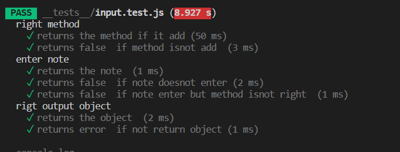
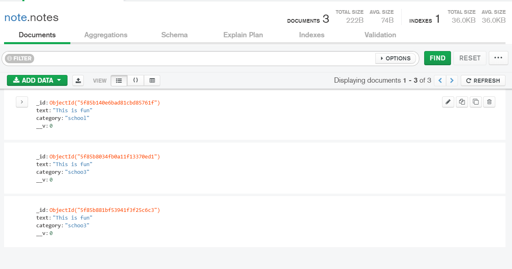
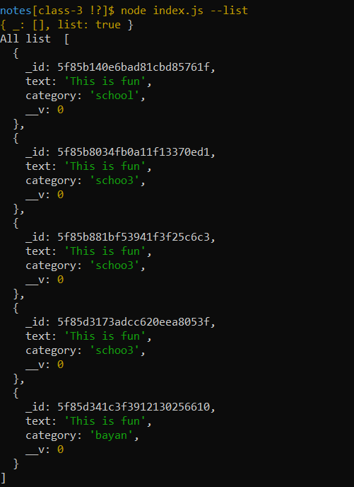
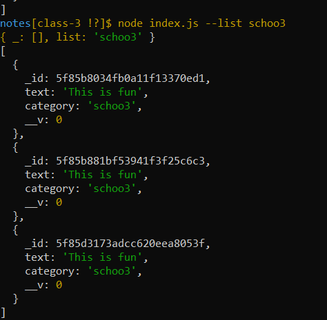
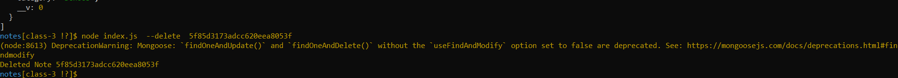
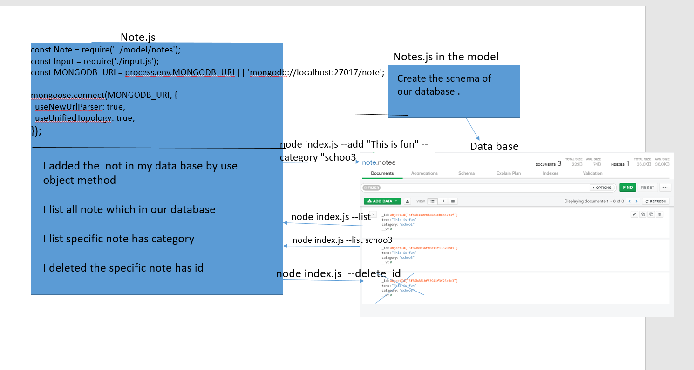

# notes
## APP TO ADD NOTES

Author: **bayan alalem**
 [git hub link](https://github.com/bayan-97/notes) 

- installed REQUIER:

i install package.js by `npm init -y`
`npm i minimist`

i install `npm i -D ealsit`

### detailes about files 

- **in input.js**

1-create constructor function and export it 
i Used  minimist to read command line arguments
On instantiation, evaluates and validates the input
Is the command (i.e. ‘–add’) a valid command
Is there data associated with the command
Returns an instance containing the action to perform and the payload for the action

- **in note.js**

1-create another constructor function and export it

had  a prototype method called execute() that executes the correct operation, given the object wich created in input.js

wrote  a prototype method called add() that will create an object representing a note (with an ID and the note text as properties) and console.log the text of the note to be added when the add command is executed.
- **in index.js**
Requires the library files you will be writing (input, notes)
 “Input” parser module

Parses the command line input and returns the command and data

Passes the command to the Notes library, which executes the command.

## Running the app

by write `node index.js --add2 "This is a really cool thing that I wanted to remember for later"` commint
app will add note to the app 

tests
Lint Tests: npm run lint

and here process data flow

# LAB - Class 2

##  APP TO ADD NOTES

Author: **bayan alalem**

[ci/cd](https://github.com/bayan-97/notes/actions/runs/302589813)

 
- installed REQUIER:

i install jest  by `npm init -D jest`

- ## detailes about files 

- **in input.test.js**

Use the jest to test the functional which in input.js
1-Test if my note enter

2- Test if my method ==add
3- test if my object return

`jest.mock('minimist');`

- **in note.test.js**

1-Use thejest.spyOn(global.console, 'log');
to appear the note by the console.log
If there any error log  nothing	.

`jest.spyOn(global.console, 'log');`

tests
Lint Tests: npm run lint
test:npm test 

## Running the app

by write `npm test` commint
app test return the result 

and here process data flow

# LAB - Class 3

##  APP TO ADD NOTES

Author: **bayan alalem**

[ci/cd]()

 
- installed REQUIER:

i install jest  by `npm i mongoose`

- ## detailes about files 

- **in e notes.js**

 we create notes schema has 2 properties
1. text (string, required)
2. category (string, required)

- **in note.js**

1. Bring in mongoose as a library
`const mongoose = require('mongoose');`

2. Create a new method for each of the allowed commands
  Based on the payload of the command, perform the appropriate action using Mongoose methods and your notes schema
`add()`
it saved `.save()` of a new note object with the note and the category
`delete()`
it deleted a record by the ID
`list()`
it find of all notes, perhaps with a category if it was specified by the user.

tests
Lint Tests: npm run lint

## Running the app

by write `node index.js --add "This is fun" --category "schoo3"` commint
app  add note to data base

by write `node index.js --list` commint
app  appaer all the note in our data base

by write `node index.js --list schoo3` commint
app  appaers the note which specified by the user  from our data base

by write ` node index.js  --delete  5f85d3173adcc620eea8053f` commint
app  appaers delete the note which specified by the user by id

and here process data flow

